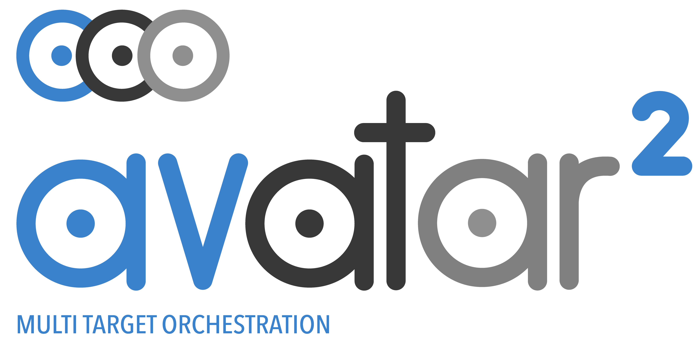

[](https://badge.fury.io/py/avatar2)
[](https://github.com/avatartwo/avatar2/actions/workflows/continuous_integration.yml)

<br/>


Welcome to avatar², the target orchestration framework with focus on dynamic
 analysis of embedded devices' firmware!

Avatar² is developed and maintained by [Eurecom's S3 Group](http://s3.eurecom.fr/).

# Building

Building avatar² is easy!

First, make sure that all the dependencies are present:

```
sudo apt-get install python-pip python-setuptools python-dev cmake
```

Afterwards, use python-pip to install avatar2:

```
pip install avatar2
```

Now you are all ready to go. Additionally, if you want to install specific
target entpoints, please run the avatar2-installer, which tries to fetch and
install the endpoints automatically.

```
python -m avatar2.installer
```

### Building with Docker

A Dockerfile is present which build by default avatar² with QEmu and PANDA target endpoints:

```
$ docker build -t avatar2 .
$ docker run --rm avatar2 python3 -c "import avatar2"
```

Alternately, you can use `generate_dockerfile.py` to build a docker image with only the target endpoints your need:

```
$ python3 generate_dockerfile.py --endpoint_list avatar-qemu --qemu_targets arm-softmmu
$ docker build -t avatar2 .
```

### Building manually

Avatar² can also be built manually.
The following three commands are enough to install the core.
```
$ git clone https://github.com/avatartwo/avatar2.git
$ cd avatar2
$ sudo python setup.py install
```
Afterwards, the different target endpoints can be built, such as QEmu or PANDA.
For doing so, we are providing build-scripts for Ubuntu 20.04 - while other
distributions are not officially supported (yet), the scripts are known to
work with slight modifications on other distributions as well.
```
$ cd targets
$ ./build_*.sh
```

**Please Note:** These scripts add the restricted repository to
`/etc/apt/sources.list` for fetching the dependencies. If you are not comfortable
with this, please consider building avatar² in a VM/Container or install the
dependencies manually and adjust the scripts.

# Getting started
For discovering the power of avatar² and getting a feeling of its usage,
we recommend highly checking out the
[handbook](https://github.com/avatartwo/avatar2/tree/master/handbook) here on
github.
Additionally, a documentation of the API is provided
[here](https://avatartwo.github.io/avatar2-docs/) and some exemplary
avatar²-scripts can be found
[here](https://github.com/avatartwo/avatar2-examples).
Additionally, another good way to get started with avatar² is to read the official
[avatar² paper](http://s3.eurecom.fr/docs/bar18_muench.pdf) or to watch the
[34c3-talk](https://media.ccc.de/v/34c3-9195-avatar).

For further support or follow-up questions, feel free to send a mail to
avatar2 [at] lists.eurecom.fr, our public mailing list, on which you can
subscribe [here](https://lists.eurecom.fr/sympa/subscribe/avatar2).

Additionally, you can find us on [slack](https://avatartwo.slack.com/) for more
vivid means of communication - if you want an invite, just send us a mail!


# Publications
The following publications describe, use, or extend the avatar² framework:
1. M. Muench, D. Nisi, A. Francillon, D. Balzarotti. "Avatar²: A Multi-target Orchestration Platform." Workshop on Binary Analysis Research (BAR), San Diego, California, February 2018.
    - [Paper](http://s3.eurecom.fr/docs/bar18_muench.pdf) - [Code](https://github.com/avatartwo/bar18_avatar2)
2. M. Muench, J. Stijohann, F. Kargl, A. Francillon, D. Balzarotti. "What You Corrupt Is Not What You Crash: Challenges in Fuzzing Embedded Devices." Network and Distributed System Security Symposium (NDSS), San Diego, California, 2018.
    - [Paper](http://www.s3.eurecom.fr/docs/ndss18_muench.pdf) - [Code](https://github.com/avatartwo/ndss18_wycinwyc)
3. D. Maier, B. Radtke, B. Harren. "Unicorefuzz: On the Viability of Emulation for Kernelspace Fuzzing." Workshop on Offensive Technologies (WOOT), Santa Clara, California, August 2019.
    - [Paper](https://www.usenix.org/system/files/woot19-paper_maier.pdf) - [Code](https://github.com/fgsect/unicorefuzz)
4.  E. Gustafson, M. Muench, C. Spensky, N. Redini, A. Machiry, A. Francillon, D. Balzarotti, Y. E. Choe, C. Kruegel, G. Vigna. "Toward the Analysis of Embedded Firmware through Automated Re-hosting." Symposium on Resarch in Attacks, Intrusions, and Defenses (RAID), Beijing, China, September 2019.
    - [Paper](http://subwire.net/papers/pretender-final.pdf) - [Code](https://github.com/ucsb-seclab/pretender)
5.  A.A. Clements, E. Gustafson, T. Scharnowski, P. Grosen, D. Fritz, C. Kruegel, G. Vigna, S. Bagchi, M. Payer. "HALucinator: Firmware Re-hosting Through Abstraction Layer Emulation." USENIX Security Symposium, August 2020.
    - [Paper](https://www.usenix.org/system/files/sec20summer_clements_prepub.pdf) - [Code](https://github.com/embedded-sec/halucinator)
6. C. Cao, L. Guan, J. Ming, P. Liu. "Device-agnostic Firmware Execution is Possible: A Concolic Execution Approach for Peripheral Emulation." Annual Computer Security Applications Conference (ACSAC), December 2020.
    - [Paper](https://dl.acm.org/doi/10.1145/3427228.3427280) - [Code](https://github.com/dongmu/Laelaps)
7. G. Hernandez, M. Muench, D. Maier, A. Milburn, S. Park, T. Scharnowski, T. Tucker, P. Traynor, K. R.B. Butler. "FirmWire: Transparent Dynamic Analysis for Cellular Baseband Firmware." Symposium on Network and Distributed System Security (NDSS), April 2022.
    - [Paper](https://github.com/FirmWire/FirmWire/blob/main/firmwire-ndss22.pdf?raw=true) - [Code](https://github.com/FirmWire/FirmWire)


# Acknowledgements
The avatar² project was partially funded through, and supported by, SIEMENS AG - Technology.
