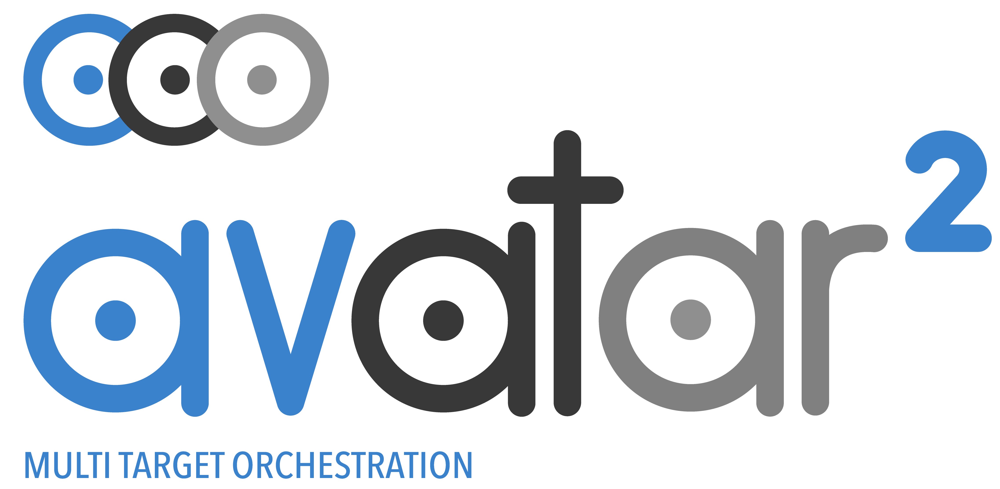

[](https://badge.fury.io/py/avatar2)
[](https://github.com/avatartwo/avatar2/actions/workflows/continuous_integration.yml)

<br/>


Welcome to avatar², the target orchestration framework with focus on dynamic
 analysis of embedded devices' firmware!

Avatar² is developed and maintained by [Eurecom's S3 Group](http://s3.eurecom.fr/).


# Building

Building avatar² is easy!

### Docker

You can easily get started with two commands:
```sh
$ docker-compose build
$ docker-compose run --rm avatar2-arm
```

We provide under the `docker/` directory two dockerfile `avatar2-core.Dockerfile` and `avatar2.Dockerfile` .
The main difference between the two images is that the latter includes QEMU.
For more example on available images, refer to the `docker-compose.yml` file.

### PyPI

Avatar² is also present on [PyPI](https://pypi.org/project/avatar2/)!

We recommands you to use a [Python virtual environment](https://virtualenvwrapper.readthedocs.io/en/latest/).

First, make sure that all the dependencies are present:
```
apt-get install python-pip python-setuptools python-dev cmake
```

Afterwards, use pip to install avatar2:
```
python3 -m pip install avatar2
```

Now you will need to install the supported endpoints you would like to use, such as debuggers (`gdb-multiarch`, `openocd`) and emulators (`qemu-system-*`, `panda-system-*`, etc.).

The old avatar2-installer tries to fetch and install them automatically, but is not actively supported.
```
python -m avatar2.installer
```

### Building manually

Avatar² can also be built manually.

The following three commands are enough to install the core.
```
$ git clone https://github.com/avatartwo/avatar2.git avatar2
$ cd avatar2
$ python -m pip install .
```

For more detailed installation instructions, we encourage you to take a look at `avatar2-core.Dockerfile` and `avatar2.Docker`, as they provide step-by-step commands similar to shell instructions.

Afterwards, the different target endpoints can be built, such as QEmu or PANDA.
For doing so, we are providing build-scripts for Ubuntu 20.04 - while other
distributions are not officially supported (yet), the scripts are known to
work with slight modifications on other distributions as well.
```
$ cd targets
$ ./build_*.sh
```

**Please Note:** These scripts add the restricted repository to
`/etc/apt/sources.list` for fetching the dependencies. If you are not comfortable
with this, please consider building avatar² in a VM/Container or install the
dependencies manually and adjust the scripts.


# Getting started

For discovering the power of avatar² and getting a feeling of its usage,
we recommend highly checking out the
[handbook](https://github.com/avatartwo/avatar2/tree/master/handbook) here on
github.
Additionally, a documentation of the API is provided
[here](https://avatartwo.github.io/avatar2-docs/) and some exemplary
avatar²-scripts can be found
[here](https://github.com/avatartwo/avatar2-examples).
Additionally, another good way to get started with avatar² is to read the official
[avatar² paper](http://s3.eurecom.fr/docs/bar18_muench.pdf) or to watch the
[34c3-talk](https://media.ccc.de/v/34c3-9195-avatar).

For further support or follow-up questions, feel free to send a mail to
avatar2 [at] lists.eurecom.fr, our public mailing list, on which you can
subscribe [here](https://lists.eurecom.fr/sympa/subscribe/avatar2).

Additionally, you can find us on [slack](https://avatartwo.slack.com/) for more
vivid means of communication - if you want an invite, just send us a mail!


# Publications

The following publications describe, use, or extend the avatar² framework:

1. M. Muench, D. Nisi, A. Francillon, D. Balzarotti. "Avatar²: A Multi-target Orchestration Platform." Workshop on Binary Analysis Research (BAR), San Diego, California, February 2018.
    - [Paper](http://s3.eurecom.fr/docs/bar18_muench.pdf) - [Code](https://github.com/avatartwo/bar18_avatar2)
2. M. Muench, J. Stijohann, F. Kargl, A. Francillon, D. Balzarotti. "What You Corrupt Is Not What You Crash: Challenges in Fuzzing Embedded Devices." Network and Distributed System Security Symposium (NDSS), San Diego, California, February 2018.
    - [Paper](http://www.s3.eurecom.fr/docs/ndss18_muench.pdf) - [Code](https://github.com/avatartwo/ndss18_wycinwyc)
3. D. Maier, B. Radtke, B. Harren. "Unicorefuzz: On the Viability of Emulation for Kernelspace Fuzzing." Workshop on Offensive Technologies (WOOT), Santa Clara, California, August 2019.
    - [Paper](https://www.usenix.org/system/files/woot19-paper_maier.pdf) - [Code](https://github.com/fgsect/unicorefuzz)
4.  E. Gustafson, M. Muench, C. Spensky, N. Redini, A. Machiry, A. Francillon, D. Balzarotti, Y. E. Choe, C. Kruegel, G. Vigna. "Toward the Analysis of Embedded Firmware through Automated Re-hosting." Symposium on Resarch in Attacks, Intrusions, and Defenses (RAID), Beijing, China, September 2019.
    - [Paper](http://subwire.net/papers/pretender-final.pdf) - [Code](https://github.com/ucsb-seclab/pretender)
5.  A.A. Clements, E. Gustafson, T. Scharnowski, P. Grosen, D. Fritz, C. Kruegel, G. Vigna, S. Bagchi, M. Payer. "HALucinator: Firmware Re-hosting Through Abstraction Layer Emulation." USENIX Security Symposium, August 2020.
    - [Paper](https://www.usenix.org/system/files/sec20summer_clements_prepub.pdf) - [Code](https://github.com/embedded-sec/halucinator)
6. C. Cao, L. Guan, J. Ming, P. Liu. "Device-agnostic Firmware Execution is Possible: A Concolic Execution Approach for Peripheral Emulation." Annual Computer Security Applications Conference (ACSAC), December 2020.
    - [Paper](https://dl.acm.org/doi/10.1145/3427228.3427280) - [Code](https://github.com/dongmu/Laelaps)
7. F. Gritti, L. Fontana, E. Gustafson, F. Pagani, A. Continella, C. Kruegel, G. Vigna. "Symbion: Interleaving symbolic with concrete execution." IEEE Conference on Communications and Network Security (CNS), June 2020
    - [Paper](https://seclab.cs.ucsb.edu/files/publications/gritti2020_symbion.pdf) - [Code](https://github.com/degrigis/symbion-use-cases)
8. C. Spensky, A. Machiry, N. Redini, C. Unger, G. Foster, E. Blasband, H. Okhravi, C. Kruegel, G. Vigna. "Conware: Automated modeling of hardware peripherals." ACM Asia conference on computer and communications security (ASIACCS), November 2021
    - [Paper](https://dl.acm.org/doi/abs/10.1145/3433210.3437532) - [Code](https://github.com/ucsb-seclab/conware)
9. A. Mera, B. Feng, L. Lu, E. Kirda. "DICE: Automatic emulation of DMA input channels for dynamic firmware analysis." IEEE Symposium on Security and Privacy (SP), May 2021
    - [Paper](https://seclab.nu/static/publications/ieeesp21dice.pdf) - [Code](https://github.com/RiS3-Lab/DICE-DMA-Emulation)
10. L. Craig, A. Fasano, T. Ballo, T. Leek, B. Dolan-Gavitt, W. Robertson.  "PyPANDA: taming the pandamonium of whole system dynamic analysis." NDSS Binary Analysis Research Workshop (BAR), February 2021
    - [Paper](https://www.ndss-symposium.org/wp-content/uploads/bar2021_23001_paper.pdf) - [Code](https://github.com/panda-re/bar2021)
11. T. Scharnowski, N. Bars, M. Schloegel, E. Gustafson, M. Muench, G. Vigna, C. Kruegel, T. Holz, A. Abbasi. "Fuzzware: Using precise MMIO modeling for effective firmware fuzzing." USENIX Security Symposium, Boston,	Massachusetts, August 2022
    - [Paper](https://www.usenix.org/system/files/sec22-scharnowski.pdf) - [Code](https://github.com/fuzzware-fuzzer/fuzzware)
12. G. Hernandez, M. Muench, D. Maier, A. Milburn, S. Park, T. Scharnowski, T. Tucker, P. Traynor, K. R.B. Butler. "FirmWire: Transparent Dynamic Analysis for Cellular Baseband Firmware." Symposium on Network and Distributed System Security (NDSS), San Diego, California, April 2022.
    - [Paper](https://github.com/FirmWire/FirmWire/blob/main/firmwire-ndss22.pdf?raw=true) - [Code](https://github.com/FirmWire/FirmWire)
13. L. Situ, C. Zhang, L. Guan, Z. Zuo, L. Wang, X. Li, P. Liu, J. Shi. "Physical devices-agnostic hybrid fuzzing of IoT firmware." IEEE Internet of Things Journal, 2023
    - [Paper](https://guanle.org/pdf/iotj23.pdf) - [Code](https://github.com/stuartly/FirmHybirdFuzzer)
14. K. Feng, M.M. Cook, A.K. Marnerides. "Sizzler: Sequential fuzzing in ladder diagrams for vulnerability detection and discovery in Programmable Logic Controllers." IEEE Transactions on Information Forensics and Security, 2023
    - [Paper](https://ieeexplore.ieee.org/abstract/document/10347559) - [Code](https://github.com/7linux-0/Sizzler)
15. C. Lindenmeier, M. Payer, M. Busch. "EL3XIR: Fuzzing COTS Secure Monitors." USENIX Security Symposium, Philadelphia, Pennsylvania, August 2024
    - [Paper](https://www.usenix.org/system/files/usenixsecurity24-appendix-lindenmeier.pdf) - [Code](https://github.com/HexHive/EL3XIR)
16. C. Lindenmeier, M. Schulze, J. Röckl, M. Busch. "SyncEmu: Enabling Dynamic Analysis of Stateful Trusted Applications." IEEE European Symposium on Security and Privacy Workshops (EuroS&PW), Vienna, Austria July 2024
    - [Paper](https://systex24.github.io/papers/systex24-final28.pdf) - [Code](https://github.com/syncemu/syncemu)
17. P. Olivier, M. Muench, A. Francillon. "0x41414141: Avatar² Artifacts, Advances and Analysis." Annual Computer Security Applications Conference (ACSAC), Finalist of the "Artifacts Competition and Impact Award", Waikiki, Hawaii, December 2024.
    - [Paper](https://www.s3.eurecom.fr/docs/acsac24_olivier.pdf)

We compiled their features usage below.
| Publication | Year | Target Orchestration | State Transfer | Peripheral Modeling | Configurable Machine |
|-------------|------|----------------------|----------------|---------------------|----------------------|
| WYCINWYC    | 2018 | ✓ | ✓ | ✓ | ✓ |
| Unicorefuzz | 2019 | ✓ | — | — | — |
| Pretender   | 2019 | — | — | ✓ | — |
| HALucinator | 2020 | ✓ | — | — | — |
| Laelaps     | 2020 | — | ✓ | — | — |
| SYMBION     | 2020 | ✓ | — | — | — |
| Conware     | 2021 | — | — | ✓ | — |
| DICE        | 2021 | — | — | ✓ | — |
| PyPANDA     | 2021 | — | — | — | ✓ |
| Fuzzware    | 2022 | — | — | ✓ | — |
| Firmwire    | 2022 | — | — | ✓ | ✓ |
| FirmHybridFuzzer | 2023 | — | — | ✓ | ✓ |
| Sizzler     | 2023 | ✓ | — | — | ✓ |
| EL3XIR      | 2024 | — | — | ✓ | ✓ |
| SyncEmu     | 2024 | — | — | ✓ | ✓ |


# Acknowledgements

The avatar² project was partially funded through, and supported by, SIEMENS AG - Technology.
